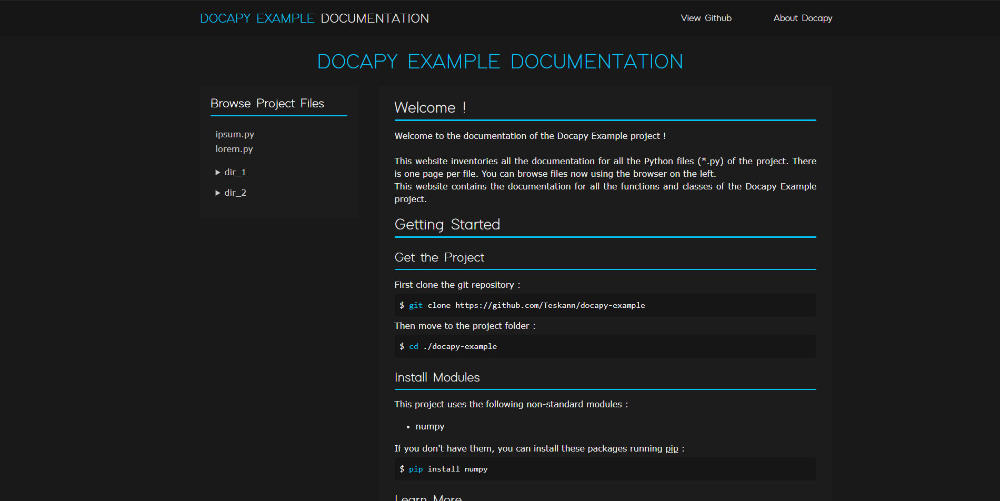

# Docapy - HTML Python Documentation Generator

## Description

Docapy is a tool to generate documentation for your Python projects using the [Numpydoc](https://numpydoc.readthedocs.io/en/latest/format.html) convention.
Docapy creates HTML files (CSS included) so you can upload your documentation on your own website !

## Why Docapy ?

Many documentation generators are already avaliable. However, most of them don't work as I expected or take a long time to configure.
**With Docapy, thing have never been easier** : you just have to run the program giving your project folder's path. And it's done.
Moreover, Docapy creates catchy websites that are easy to read, include references between files, detect imported modules and much more ...

## Getting Started

First, clone this repository :

```bash
git clone https://github.com/Teskann/Docapy
```

Then move to the Docapy directory running :
```bash
cd Docapy
```
You can now open *edit_and_run_me.py* with any text editor to setup Docapy for your project. The setup is very easy :
- Specify your project's name
- Specify your project's folder
- Specify the link of your repository (Github, Gitlab ...)
- Specify the accent color you wish for your documentation

Then, run *edit_and_run_me.py* :
```bash
python edit_and_run_me.py
```

You are done !

Now, open the folder of your project. You should see that a directory called `docapy` has been created. It contains all the documentation of your project !
You can copy its whole content to your documentation website (index.html is included)

## Features

Docapy generates documentation for every `*.py` file of your project.

This documentation contains :
- Functions (including nested functions)
- Classes (including nested classes and methods)
- Files (docstring at the begining of a file)

It also includes :
- Imports detection for each file :
    - Adds a link to the documentation page for an import in this project
    - Adds a link to the official Python documentation for standard module imports
    - Adds a link to the pip page for any other import and adds details on how to install the module (`pip install ...`)
- Index HTML page is created containing project overview
- File documentation browser on the left of the page

## Supported and not Supported Docstring Syntaxes

For the moment, Docapy only supports [Numpydoc](https://numpydoc.readthedocs.io/en/latest/format.html) docstring format.
You can run it with other documentation syntaxes but you shouldn't get the expected result.

Why Numpydoc ? In my opinion, this is the most readable docstring format when you display it in Python directly with `print(function_name.__doc__)`.
Your documentation will then be pretty on your website and in your code as well.

Supported features are :
- Title detection
- Lists support
- Indentation support
- inline code support (`>>>`)

**Not** supported (yet) Numpydoc syntaxes are :
- `.. image::`
- `.. math::`
- `.. warning::`
- `..note ::`

## Examples

Here is an example on how to use Docapy on a Lorem Ipsum project :

- Clone the project
```bash
git clone https://github.com/Teskann/docapy-example
```

- Open *edit_and_run_me.py*
- Set `project_name` to `"Docapy Example"`
- Set `project_path` to the path of docapy-example repository
- Set `repo_link` to `"https://github.com/Teskann/docapy-example"`
- Set `color` to `"cyan"`
- Run *edit_and_run_me.py*

You should get the result uploaded here : https://teskann.github.io/docapy-example/index.html



For a better example, you can check out the [documentation Docapy generated for my URDFast project](https://teskann.github.io/urdfast-documentation/).

## Create Your Own CSS

You can of course create your own CSS to style your documentation HTML files. In
this case, edit *style.css*. Here is a list of all the elements that might be
created by Docapy :

Classes :

- `.navbar` : `<div>` for top page navigation bar
- `.title` : Title of your project (in the navigation bar)
- `.titla` : The `<a>` element linking to the index page on the title
- `.blue` : `<span>` in which text shoule be displayed in the accent color
- `.links` : Links to the repository and to Docapy repository on the right of the navigation bar
- `.sideMenu` : `<div>` containing the file browser
- `.import` : `<a>` elements containing hyperlinks to the imports documentation pages
- `.menuDetails` : `<details>` elements in the file browser division on the left
- `.menuSummary` : `<summary>` elements in the file browser division on the left
- `.content` : Main `<div>` containing everything except the navigation bar and the file browser
- `.indent` : `<div>` to display indentation (must have a positive `margin-left`)
- `def` : `<span>` in which text can be styled
- `code` : `<div>` to display code

Elements :
- `<body>`, `<html>`
- `<summary>` (without class) : Summary for functions & classes definitions
- `<details>` (without class) : Details for functions & classes definitions
- `<a>`
- `<b>`
- `<h1>`, `<h2>`, `<h3>`

## Contribute

If you like this project you can contribute to it and help adding some new features !

In this case check out the [documentation of the code](https://teskann.github.io/docapy-documentation/).

Thanks in advance for what you will bring to this project.